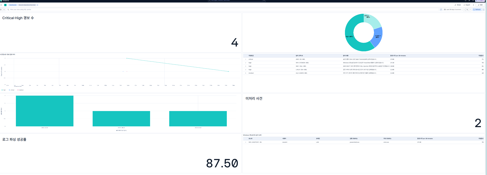
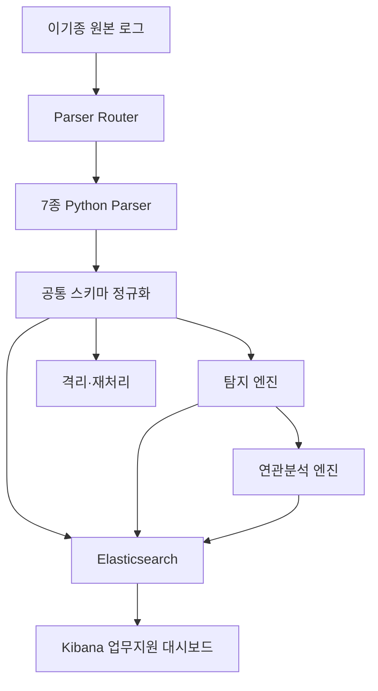

# 이기종 보안 로그 통합 분석 및 보안관제 업무지원 대시보드

AWS·Linux·웹·Windows 엔드포인트에서 발생하는 서로 다른 형식의 로그를 Python 파서로 정규화하고, 탐지·연관분석·격리·재처리한 뒤 Elasticsearch와 Kibana에서 통합 분석하는 보안관제 프로젝트입니다.

## 1. 프로젝트 개요

보안관제 환경에서는 CloudTrail, WAF, ALB, 웹서버, Linux 인증, 애플리케이션, Windows 엔드포인트 등 여러 시스템이 서로 다른 형식으로 로그를 생성합니다.

이 프로젝트는 다음 문제를 해결하는 것을 목표로 합니다.

- 로그마다 형식과 필드가 달라 통합 분석이 어려운 문제
- 애플리케이션별 로그 파싱 및 태깅 기준이 일관되지 않은 문제
- 개별 로그만으로 공격 흐름을 파악하기 어려운 문제
- 파싱 실패가 전체 보안관제 파이프라인을 중단시키는 문제
- 보안 담당자가 경보와 사건을 즉시 확인하기 어려운 문제

## 보안관제 대시보드



대시보드는 다음과 같은 보안관제 업무 정보를 한 화면에서 제공합니다.

- Critical·High 위험 경보 수
- 위험등급별 경보 분포
- 시간대별 경보 발생 추이
- 최근 탐지 경보와 위험점수
- 공격 출발지 IP TOP 5
- 미처리 보안 사건 수
- 로그 파싱 성공률
- Windows Sysmon 엔드포인트 탐지 상세

### 핵심 차별점

- 7종 이기종 로그에 각각 다른 Python 파서 적용
- 모든 로그를 동일한 공통 스키마로 정규화
- 단일 이벤트·임계치·연관분석 탐지 지원
- 파싱 실패 로그 격리 및 재처리
- Windows Sysmon 기반 EDR 탐지 지원
- Elasticsearch 저장 및 Kibana 업무지원 대시보드 제공
- 총 105개 자동 테스트를 통한 회귀 검증

---

## 2. 주요 실행 결과

| 항목 | 결과 |
|---|---:|
| 입력 로그 파일 | 8개 |
| 지원 로그 종류 | 7종 |
| 정상 파싱 파일 | 7개 |
| 격리된 실패 파일 | 1개 |
| 정규화 이벤트 | 11건 |
| 파싱 성공률 | 87.5% |
| 단일 이벤트 경보 | 4건 |
| 임계치 경보 | 1건 |
| 전체 보안 경보 | 5건 |
| 보안 사건 | 2건 |
| 자동 테스트 | 105개 통과 |

> 현재 데이터는 기능 검증을 위한 소규모 샘플입니다. 운영 환경에서는 Filebeat, Elastic Agent 또는 AWS 로그 수집 기능과 연결할 수 있습니다.

---

## 3. 시스템 아키텍처



### 데이터 처리 흐름

1. 원본 로그 파일을 읽습니다.
2. Parser Router가 로그 종류를 자동으로 판별합니다.
3. 로그 종류에 맞는 전용 Python 파서를 호출합니다.
4. 공통 필드와 보안 태그를 적용합니다.
5. 단일 이벤트 및 임계치 탐지 규칙을 실행합니다.
6. trace ID 또는 고위험 엔드포인트 경보를 보안 사건으로 변환합니다.
7. 파싱 실패 로그는 별도 격리 파일에 저장합니다.
8. 이벤트·경보·사건·통계를 Elasticsearch에 저장합니다.
9. Kibana 대시보드에서 보안관제 현황을 시각화합니다.

---

## 4. 지원 로그 및 파서

| 로그 종류 | 파서 | 주요 분석 필드 |
|---|---|---|
| AWS CloudTrail | `cloudtrail_parser.py` | API 행위, IAM 사용자, 리전, 보안그룹 |
| AWS WAF | `waf_parser.py` | 공격 유형, 요청 경로, 차단 결과, 출발지 IP |
| AWS ALB | `alb_parser.py` | HTTP 상태, 처리시간, URL, trace ID |
| Nginx Access | `nginx_parser.py` | 클라이언트 IP, URL, 응답 코드, 요청시간 |
| Linux Auth | `linux_auth_parser.py` | SSH 사용자, 출발지 IP, 로그인 성공·실패 |
| Flask Application | `flask_parser.py` | 사용자, 요청 ID, 애플리케이션 결과 |
| Windows Sysmon | `sysmon_parser.py` | 호스트, 사용자, 프로세스, 부모 프로세스, 해시 |

### 자동 판별

`parsers/parser_router.py`가 파일 내용을 확인하여 다음 로그 유형 중 하나를 반환합니다.

```text
cloudtrail
waf
alb
nginx
linux_auth
flask
sysmon
```

---

## 5. 공통 정규화 스키마

모든 파서는 서로 다른 원본 로그를 다음과 같은 공통 구조로 변환합니다.

```json
{
  "@timestamp": "2026-09-29T10:30:00Z",
  "schema_version": "1.0.0",
  "event": {
    "id": "고유 이벤트 ID",
    "kind": "event",
    "category": "process",
    "action": "process_start",
    "outcome": "success",
    "severity": 0,
    "severity_label": "informational",
    "risk_score": 0
  },
  "log": {
    "source": "windows_sysmon",
    "original": "원본 로그"
  },
  "host": {
    "name": "WIN-ENDPOINT-01"
  },
  "user": {
    "domain": "LAB",
    "name": "student"
  },
  "process": {
    "name": "powershell.exe",
    "command_line": "powershell.exe -EncodedCommand ...",
    "parent": {
      "name": "cmd.exe"
    }
  },
  "trace": {
    "id": "연관분석 식별자"
  },
  "rule": {
    "id": null,
    "name": null,
    "description": null,
    "recommendation": null
  },
  "parser": {
    "name": "sysmon_parser",
    "version": "1.0.0",
    "status": "success"
  },
  "tags": [
    "windows",
    "endpoint",
    "edr",
    "sysmon"
  ]
}
```

### 주요 공통 필드

- `@timestamp`: UTC 표준 이벤트 시간
- `event.id`: 이벤트 고유 ID
- `event.category`: 이벤트 분류
- `event.action`: 수행 행위
- `event.outcome`: 성공·실패·차단 결과
- `event.risk_score`: 위험점수
- `log.source`: 로그 발생 장비 또는 서비스
- `source.ip`: 출발지 IP
- `host.name`: 엔드포인트 호스트명
- `user.name`: 사용자명
- `trace.id`: 로그 간 연관분석 식별자
- `tags`: 보안 분석용 공통 태그

---

## 6. 탐지 규칙

### 단일 이벤트 규칙

| 규칙 ID | 탐지 내용 | 등급 | 위험점수 |
|---|---|---|---:|
| `AWS-SG-001` | SSH 22번 포트가 `0.0.0.0/0`에 공개 | Critical | 95 |
| `WAF-SQLI-001` | AWS WAF SQL Injection 차단 | High | 85 |
| `ALB-ADMIN-001` | `/admin` 접근 후 401 인증 실패 | Medium | 60 |
| `WIN-SYSMON-001` | 인코딩된 PowerShell 명령 실행 | High | 90 |

### 임계치 규칙

| 규칙 | 조건 | 등급 | 위험점수 |
|---|---|---|---:|
| Linux SSH 무차별 대입 탐지 | 같은 IP에서 5분 이내 로그인 실패 5회 이상 | High | 80 |

### 문자열 포함 조건

규칙 엔진은 다음 두 조건 방식을 지원합니다.

```yaml
conditions:
  process.name: powershell.exe

contains:
  process.command_line: "-EncodedCommand"
```

- `conditions`: 필드값의 정확한 일치
- `contains`: 문자열 포함 여부를 대소문자 구분 없이 검사

---

## 7. 연관분석

### trace ID 기반 웹 요청 연관분석

동일한 `trace.id`를 가진 ALB, Nginx, Flask 이벤트를 하나의 사건 타임라인으로 통합합니다.

```text
AWS ALB
   ↓ 동일 trace.id
Nginx
   ↓ 동일 trace.id
Flask Application
   ↓
관리자 페이지 접근 연관 사건
```

### Windows 엔드포인트 사건 승격

다음 조건을 만족하는 Sysmon 경보는 단일 로그라도 사건으로 승격합니다.

```text
log.source = windows_sysmon
event.kind = alert
event.risk_score >= 80
```

생성되는 사건 정보:

- 호스트명
- 사용자 및 도메인
- 실행 프로세스
- 부모 프로세스
- 명령줄
- 위험점수
- 대응 권고사항

현재 생성되는 사건:

1. 관리자 페이지 접근 연관 이벤트
2. 인코딩된 PowerShell 명령 실행

---

## 8. 파싱 실패 격리 및 재처리

한 파일의 파싱 실패가 전체 파이프라인을 중단하지 않도록 실패 로그를 격리합니다.

### 격리 정보

- 원본 파일 경로
- 자동 판별 로그 종류
- 실패 원인
- 실패 시각
- 재처리 상태
- 재처리 횟수

격리 파일:

```text
outputs/quarantine/failed_logs.jsonl
```

재처리 실행:

```powershell
python retry_quarantine.py
```

지원 기능:

- 실패 유지
- 복구 성공 기록
- 해결된 기록 재처리 방지
- 동일 실패 기록 중복 방지

---

## 9. Kibana 업무지원 대시보드

대시보드 이름:

```text
Security Operations Overview
```

### 주요 패널

| 패널 | 업무 목적 |
|---|---|
| Critical·High 경보 수 | 즉시 대응이 필요한 경보 수 확인 |
| 위험등급별 경보 분포 | Critical·High·Medium 비율 분석 |
| 시간별 보안 경보 발생 추이 | 시간대별 경보 변화 확인 |
| 최근 보안 경보 목록 | 규칙·위험점수·탐지 내용 확인 |
| 공격 출발지 IP TOP 5 | 반복 공격 IP 식별 |
| 미처리 보안 사건 수 | 대응하지 않은 사건 수 확인 |
| 로그 파싱 성공률 | 파싱 파이프라인 상태 확인 |
| Windows 엔드포인트 탐지 상세 | 호스트·사용자·프로세스 조사 |

### 현재 대시보드 값

```text
Critical·High 경보 수: 4
전체 보안 경보: 5
미처리 사건: 2
로그 파싱 성공률: 87.5%
```

### Kibana Data View

| 이름 | 인덱스 | 시간 필드 |
|---|---|---|
| Security Events | `security-events` | `@timestamp` |
| Security Alerts | `security-alerts` | `@timestamp` |
| Security Incidents | `security-incidents` | `first_seen` |
| Parser Metrics | `parser-metrics` | `generated_at` |

---

## 10. 기술 스택

### Backend

- Python 3.12
- PyYAML
- pytest

### Data Platform

- Elasticsearch 9.5.4
- Kibana 9.5.4

### Infrastructure

- Docker Desktop
- Docker Compose
- WSL2
- Windows PowerShell
- Visual Studio Code
- Git

---

## 11. 프로젝트 구조

```text
security-ops-dashboard/
├── correlation/
│   └── correlation_engine.py
├── detection/
│   ├── rule_engine.py
│   ├── threshold_engine.py
│   ├── rules.yaml
│   └── threshold_rules.yaml
├── parsers/
│   ├── parser_router.py
│   ├── cloudtrail_parser.py
│   ├── waf_parser.py
│   ├── alb_parser.py
│   ├── nginx_parser.py
│   ├── linux_auth_parser.py
│   ├── flask_parser.py
│   └── sysmon_parser.py
├── samples/
│   ├── cloudtrail_security_group_open.json
│   ├── waf_sql_injection_block.json
│   ├── alb_admin_access.log
│   ├── nginx_admin_access.log
│   ├── linux_auth_failed.log
│   ├── flask_application.jsonl
│   ├── sysmon_suspicious_powershell.json
│   └── nginx_with_invalid_line.log
├── storage/
│   ├── elasticsearch_storage.py
│   └── quarantine.py
├── tests/
│   ├── test_cloudtrail_parser.py
│   ├── test_waf_parser.py
│   ├── test_alb_parser.py
│   ├── test_nginx_parser.py
│   ├── test_linux_auth_parser.py
│   ├── test_flask_parser.py
│   ├── test_sysmon_parser.py
│   ├── test_sysmon_detection.py
│   ├── test_correlation_engine.py
│   ├── test_sysmon_incident.py
│   └── test_quarantine_and_metrics.py
├── outputs/
│   ├── normalized/
│   ├── alerts/
│   ├── incidents/
│   ├── metrics/
│   └── quarantine/
├── docker-compose.yml
├── retry_quarantine.py
├── main.py
├── requirements.txt
└── README.md
```

> 실제 파일명은 개발 과정에서 일부 다를 수 있습니다.

---

## 12. 설치 및 실행

### 12.1 저장소 복제

```powershell
git clone <REPOSITORY_URL>
cd security-ops-dashboard
```

### 12.2 가상환경 생성

```powershell
python -m venv .venv
```

가상환경 활성화:

```powershell
.\.venv\Scripts\Activate.ps1
```

### 12.3 패키지 설치

```powershell
python -m pip install --upgrade pip
pip install -r requirements.txt
```

### 12.4 Elasticsearch·Kibana 실행

```powershell
docker compose up -d
```

상태 확인:

```powershell
docker compose ps
```

Elasticsearch 확인:

```powershell
Invoke-RestMethod "http://localhost:9200"
```

Kibana 확인:

```powershell
$response = Invoke-RestMethod `
  "http://localhost:5601/api/status"

$response.status.overall
```

정상 상태:

```text
available
```

### 12.5 파이프라인 실행

```powershell
python main.py
```

정상 실행 예시:

```text
전체 정규화 이벤트: 11건
성공 파일: 7개
실패 파일: 1개
파싱 성공률: 87.5%
단일 이벤트 경보: 4건
임계치 경보: 1건
생성된 보안 경보: 5건
생성된 보안 사건: 2건
```

### 12.6 Kibana 접속

```text
http://localhost:5601
```

---

## 13. 자동 테스트

전체 테스트:

```powershell
python -m pytest -v
```

현재 결과:

```text
105 passed
```

Sysmon 파서 테스트:

```powershell
python -m pytest `
  .\tests\test_sysmon_parser.py `
  -v
```

Sysmon 탐지 테스트:

```powershell
python -m pytest `
  .\tests\test_sysmon_detection.py `
  -v
```

연관분석 및 사건 테스트:

```powershell
python -m pytest `
  .\tests\test_correlation_engine.py `
  .\tests\test_sysmon_incident.py `
  -v
```

---

## 14. 출력 파일

| 출력 파일 | 내용 |
|---|---|
| `outputs/normalized/security_events.jsonl` | 정규화 이벤트 |
| `outputs/alerts/security_alerts.jsonl` | 보안 경보 |
| `outputs/incidents/security_incidents.jsonl` | 보안 사건 |
| `outputs/quarantine/failed_logs.jsonl` | 격리된 파싱 실패 |
| `outputs/metrics/parsing_statistics.json` | 파싱 성공·실패 통계 |

---

## 15. Elasticsearch 인덱스

```text
security-events
security-alerts
security-incidents
parser-metrics
```

사건 조회:

```powershell
curl.exe `
  -s `
  "http://localhost:9200/security-incidents/_search?size=10" `
  -o ".\outputs\incidents\elasticsearch_response.json"
```

UTF-8로 읽기:

```powershell
$response = Get-Content `
  ".\outputs\incidents\elasticsearch_response.json" `
  -Raw `
  -Encoding UTF8 |
ConvertFrom-Json
```

```powershell
$response.hits.hits |
ForEach-Object {
    $_._source
} |
Select-Object `
    incident_id,
    title,
    status,
    severity_label,
    risk_score |
Format-Table
```

---

## 16. 주요 트러블슈팅

### Docker 명령을 찾을 수 없음

Docker Desktop 설치 후 PowerShell을 다시 실행합니다.

```powershell
docker --version
docker compose version
```

### Kibana에 데이터가 표시되지 않음

- 시간 범위를 `Last 30 days`로 설정합니다.
- 올바른 Data View인지 확인합니다.
- Kibana의 `Refresh`를 누릅니다.
- 전역 필터가 잘못 적용되지 않았는지 확인합니다.

### `event.risk_score`와 `rule.risk_score`

대시보드 위험점수는 다음 필드를 사용합니다.

```text
event.risk_score
```

`rule.risk_score`는 사용하지 않습니다.

### Windows PowerShell에서 한글 깨짐

PowerShell의 `Invoke-RestMethod`가 Elasticsearch UTF-8 응답을 잘못 해석할 수 있습니다.

`curl.exe`로 응답을 파일에 저장하고 다음처럼 읽습니다.

```powershell
Get-Content `
  ".\outputs\incidents\elasticsearch_response.json" `
  -Raw `
  -Encoding UTF8
```

Python·Elasticsearch·Kibana에서 한글이 정상이고 PowerShell에서만 깨진다면 저장 오류가 아닙니다.

### 파싱 실패 로그

의도적으로 잘못된 Nginx 로그를 포함하여 격리 기능을 검증합니다.

```text
samples/nginx_with_invalid_line.log
```

이 파일의 파싱 실패는 정상적인 테스트 결과입니다.

---

## 17. 보안관제 시연 시나리오

### 시나리오 1: AWS 보안그룹 오설정

1. CloudTrail에서 `AuthorizeSecurityGroupIngress` 확인
2. SSH 22번 포트와 `0.0.0.0/0` 탐지
3. Critical·위험점수 95점 경보 생성
4. 관리자 IP로 접근 범위 제한 권고

### 시나리오 2: WAF SQL Injection

1. AWS WAF 차단 로그 수집
2. SQL Injection 규칙 식별
3. High·위험점수 85점 경보 생성
4. 공격 IP 및 웹서버 연관 로그 확인 권고

### 시나리오 3: SSH 무차별 대입

1. Linux 인증 실패 로그 수집
2. 동일 IP의 5분 내 실패 5회 집계
3. High·위험점수 80점 경보 생성
4. 공격 IP 차단 및 계정 점검 권고

### 시나리오 4: Windows Encoded PowerShell

1. Sysmon Event ID 1 수집
2. `powershell.exe`와 `-EncodedCommand` 탐지
3. High·위험점수 90점 경보 생성
4. Windows 엔드포인트 보안 사건으로 승격
5. 호스트·사용자·부모 프로세스 조사

---

## 18. 프로젝트에서 해결한 기술적 문제

- 서로 다른 JSON·텍스트 로그 자동 판별
- 로그별 필드 차이를 공통 스키마로 정규화
- Nginx 이벤트 ID와 trace ID 분리
- ALB·Nginx·Flask 요청 연관분석
- 5분 시간창 기반 SSH 임계치 탐지
- 파싱 실패 격리 및 재처리
- 실패 기록 중복 방지
- Elasticsearch 한글 저장 및 조회
- Windows Sysmon 프로세스 이벤트 정규화
- 문자열 포함 탐지 조건 구현
- 고위험 엔드포인트 경보의 사건 승격
- Kibana 다중 Data View 대시보드 구성

---

## 19. 현재 제한사항

- 샘플 파일 기반 배치 처리 중심
- Sysmon Event ID 1만 지원
- 사건 상태 변경 UI 미구현
- 사용자 인증 및 권한 관리 미구현
- 알림 전송 기능 미구현
- 실제 대규모 로그 성능 검증 미수행

---

## 20. 향후 개선 계획

- Filebeat·Elastic Agent 기반 실시간 수집
- AWS S3·CloudWatch 연동
- Sysmon Event ID 3·11·22 지원
- 사건 상태 변경 및 담당자 지정
- Slack·이메일 경보 전송
- Elasticsearch 인덱스 템플릿 및 ILM 적용
- GitHub Actions 자동 테스트
- MITRE ATT&CK 기술 매핑
- 대규모 로그 부하 및 성능 테스트

---

## 21. 포트폴리오 핵심 요약

이 프로젝트를 통해 다음 역량을 검증했습니다.

- Python 기반 로그 파서 설계
- 이기종 로그 공통 스키마 설계
- YAML 기반 탐지 규칙 구현
- 시간창 기반 임계치 탐지
- trace ID 기반 연관분석
- Windows Sysmon EDR 로그 분석
- 실패 격리 및 재처리 설계
- Elasticsearch 데이터 저장
- Kibana 업무지원 대시보드 구성
- pytest 기반 자동 회귀 테스트

---

## License

본 프로젝트는 학습 및 취업 포트폴리오 목적으로 제작되었습니다.